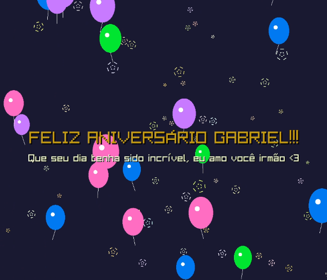

# Message Card Creator

A simple C application that creates animated greeting cards with customizable messages, floating balloons, and twinkling stars. Built with Raylib graphics library.



## About the Project

Created as a simple birthday gift, the project evolved so that any user could create interactive commemorative messages in a simple and easy way.

## Features

- **Custom Messages**: Add up to 3 lines of personalized text with bounce animation
- **Heart Balloons**: Option to use heart-shaped balloons for romantic messages
- **Cinematic Animation**: Staged intro with stars appearing first, then text, then rising balloons
- **Cinematic GIF Export**: Save as 18.3-second staged animation with smooth intro/outro
- **Simple Interface**: Clean, easy-to-use message input interface

## Requirements

- GCC compiler
- Raylib graphics library
- Make build system
- Linux environment (tested on Ubuntu/Debian)

## Installation

1. **Install Dependencies** (Ubuntu/Debian):
```bash
make install-deps
```

2. **Build the Application**:
```bash
make
```

## How to Use

1. **Fork the project** to your GitHub account

2. **Clone the repository** to your local machine

3. **In your preferred editor**, run the commands:
   ```bash
   make
   make run
   ```

4. **Create Your Message**:
   - Enter your main message (title)
   - Add a secondary message (optional)
   - Add a third message (optional)
   - Check "Use heart-shaped balloons" for romantic cards
   - Click "Create Animation"

5. **View and Export**:
   - Watch your animated message card
   - Click "Save GIF" to export as cinematic animation.gif (18.3 seconds, smooth 33 FPS)
   - Click "Edit" to modify your message

## Application Flow

```
Message Input → Animation Display → Cinematic GIF Export
     ↑                    ↓
     └─── Edit Button ────┘
```

## Build Options

- `make` - Standard build
- `make debug` - Build with debug symbols
- `make release` - Optimized release build
- `make clean` - Remove object files
- `make clean-all` - Remove all build artifacts

## GIF Animation Sequence

The exported GIF follows a cinematic 18.3-second sequence:

1. **0-0.5s**: Blue background fade-in
2. **0.5-1s**: Stars appear with fade-in
3. **1.5-2s**: Text appears with bounce animation
4. **2s+**: Balloons start rising from bottom naturally
5. **2-12.5s**: Full animation with all elements (10.5 seconds)
6. **12.5-14s**: Balloons fade out gradually (1.5 seconds)
7. **14-14.4s**: Text fades out (0.4 seconds)
8. **14.4-14.8s**: Stars fade out (0.4 seconds)
9. **14.8-18.3s**: Blue background with ":)" smiley (3.5 seconds)

## File Structure

```
MessageCard/
├── src/
│   ├── main.c              # Main application entry
│   ├── messageInterface.c  # Message input interface
│   ├── animation.c         # Animation and GIF export
│   ├── balloon.c           # Balloon graphics and physics
│   ├── star.c              # Star graphics and animations
│   └── gif.c               # GIF encoding library
├── include/
│   ├── raylib/             # Local raylib headers
│   │   ├── raylib.h        # Raylib graphics library
│   │   └── raymath.h       # Raylib math utilities
│   ├── config.h            # Application configuration
│   ├── messageInterface.h  # Interface declarations
│   ├── animation.h         # Animation declarations
│   ├── balloon.h           # Balloon declarations
│   ├── star.h              # Star declarations
│   └── gif.h               # GIF encoding declarations
├── bin/                    # Compiled executable
├── build/                  # Object files
└── Makefile                # Build configuration
```

## Configuration

The application uses these default settings (defined in `config.h`):
- Screen resolution: 1024x658
- Animation duration: 18.3 seconds (cinematic sequence with staged intro/outro)
- GIF frame rate: 30 FPS recording, 33 FPS playback (ultra-smooth animation)
- Maximum 20 balloons, 50 stars
- Background color: Dark blue (25, 25, 50)
- Local raylib headers: Included in `include/raylib/` directory

## Dependencies

- **Raylib** and derived libraries
- C compiler (gcc, mingw-w64 for Windows builds)
- Make

## Credits

Created by Fernanda.
Built with [Raylib](https://www.raylib.com/).
gif.h/.c based on gif-h by [gif-h](https://github.com/charlietangora/gif-h).

## License

[MIT License](LICENSE)
